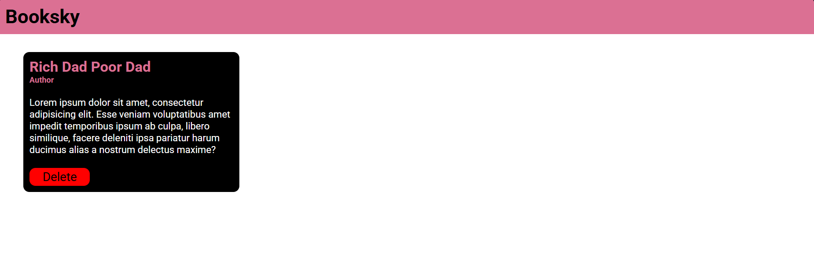

<h1>Booksky</h1>

<strong>Booksky</strong> is a simple web application that allows users to store, view, and manage their favorite books. Each book entry contains the <strong>title</strong>, <strong>author name</strong>, and a <strong>short description</strong>, displayed in a neat card format. Users can also delete books from the list when no longer needed.

<h2>Features</h2>
<ul>
  <li>Add and display books with <strong>title, author, and description</strong></li>
  <li>Responsive card-style UI for each book</li>
  <li><strong>Delete functionality</strong> to remove books</li>
  <li>Minimal and user-friendly design</li>
</ul>

<h2>Tech Stack</h2>
<ul>
  <li><strong>HTML</strong> – Structure of the app</li>
  <li><strong>CSS</strong> – Styling and responsive UI</li>
  <li><strong>JavaScript</strong> – Dynamic rendering and delete functionality</li>
</ul>

<h2>Screenshot</h2>
<!-- Replace the src with your GitHub raw image link or keep local if inside assets/ -->

